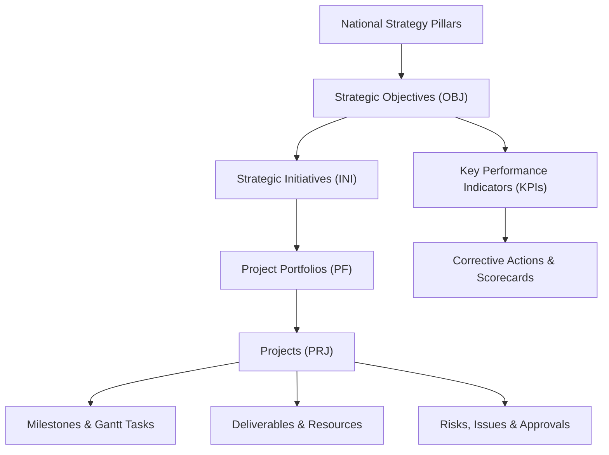

# Enterprise Strategy Command Center — Platform Overview & Architecture Documentation

## 1. Executive Summary

The **Strategy Command Center** is a high-fidelity enterprise-grade platform designed for national strategy execution, strategic performance cascading, project & portfolio management (PPM), GRC (Governance, Risk, and Compliance), and financial oversight. 

Built as a static frontend demo with persistent client-side data management, it enables executive leadership, strategy directors, project managers, and department heads to monitor, govern, and execute complex cross-sector portfolios.

---

## 2. Technology Stack & Technical Architecture

| Layer | Technology | Details |
|---|---|---|
| **Core Framework** | React 19 + TypeScript | Strict type safety, functional components, custom hooks |
| **Build Tooling** | Vite 5 | Fast HMR dev server and optimized production bundler |
| **Styling & Design** | Tailwind CSS v4 + Vanilla CSS | Modern OKLCH color token system supporting Light/Dark modes |
| **Icons & UI Extras** | Lucide React + Sonner | High-contrast icon set and accessible toast notifications |
| **Data Visualisation** | Recharts | Interactive executive charts, trend lines, & area graphs |
| **Routing & Auth** | React Router v7 + Context API | Guarded routes (`ProtectedRoute`), `AuthContext`, & session state |
| **State & Persistence** | Custom Reactive Store | `localStorage`-backed reactive store with seeding & reset capabilities |

---

## 3. Core Operational Modules



### 3.1 Strategy Management
* **Strategic Pillars**: High-level national vision themes (e.g., Digital Economy, Infrastructure, Governance).
* **Strategic Objectives**: Quantifiable goals linked to owning departments with performance baselines and target timelines.
* **Strategic Initiatives**: Multi-project programmes consolidating transformation activities and budget allocations.
* **Strategy Map**: Interactive visual mapping connecting pillars $\rightarrow$ objectives $\rightarrow$ KPIs $\rightarrow$ initiatives.

### 3.2 Performance Management
* **KPI Repository**: Comprehensive directory of leading and lagging key performance indicators.
* **Scorecards**: Periodic evaluation scorecards with trend analysis (Jan–Aug actuals vs targets).
* **Performance Cascading**: Hierarchical breakdown of performance metrics across sectors, departments, and entities.
* **Corrective Actions**: Recovery plans automatically triggered for lagging or off-track KPIs.

### 3.3 Project & Portfolio Management (PPM)
* **Portfolios**: Enterprise grouping of related capital, digital, and infrastructure investments.
* **Projects**: Full project lifecycle tracking including budget vs actual cost, health scores, and deliverables.
* **Interactive Gantt Plan**: Phase schedules, task timelines, dependencies, and milestone gates.
* **Resource Allocation**: Utilization tracking, FTE allocation, and daily billing rates per role.

### 3.4 Governance, Risk & Approvals
* **Risk & Issue Register**: Heatmap matrices (Probability vs Impact), mitigation plans, and issue tracking.
* **Stakeholder Management**: Influence vs Interest matrix mapping for regulatory and delivery partners.
* **Workflows & Approvals**: Multi-stage approval queue for project baselines, budget changes, and deliverable sign-offs.

### 3.5 Financials & Reporting
* **Financial Management**: Operating & capital expenditure tracking, variance analysis, and budget burn rates.
* **Report History**: Automated executive summary reports, scorecard packs, and export capabilities.

---

## 4. Role-Based Access Control (RBAC) Architecture

The application enforces a **7-Role Persona System** mapped across all platform features:

| Module / Feature | Admin | Executive | Strategy Mgr | Performance Mgr | Project Mgr | Dept Mgr | Viewer |
|---|:---:|:---:|:---:|:---:|:---:|:---:|:---:|
| **Executive Dashboard** | ✅ | ✅ | ✅ | ✅ | ✅ | ✅ | ✅ |
| **Strategy & Objectives (CRUD)** | ✅ | ✅ | ✅ | ❌ | ❌ | ✅ | ❌ |
| **KPI Scorecards & Cascading** | ✅ | ✅ | ✅ | ✅ | ❌ | ✅ | ❌ |
| **Project & Portfolio Management** | ✅ | ✅ | ❌ | ❌ | ✅ | ✅ | ❌ |
| **Risks & Issues Governance** | ✅ | ✅ | ✅ | ✅ | ✅ | ✅ | ❌ |
| **Workflows & Approvals** | ✅ | ✅ | ✅ | ✅ | ✅ | ❌ | ❌ |
| **Financial Management** | ✅ | ✅ | ✅ | ✅ | ❌ | ❌ | ❌ |
| **Admin & User RBAC Config** | ✅ | ❌ | ❌ | ❌ | ❌ | ❌ | ❌ |

---

## 5. Service Layer Architecture

The frontend uses a unified service layer pattern (`src/services/index.ts`) abstracting data access for future backend API integration:

```typescript
// Example Service Method Pattern
export const projectService = {
  getAll: (): Project[] => getDb().projects,
  getById: (id: string): Project | undefined => getDb().projects.find((p) => p.id === id),
  create: (data: Partial<Project>): Project => { ... },
  update: (id: string, data: Partial<Project>): Project | undefined => { ... },
  delete: (id: string): boolean => { ... },
};
```

---

## 6. Getting Started & Operations

### 6.1 Running Locally
```bash
# Install dependencies
npm install

# Start Vite development server
npm run dev
```

### 6.2 Production Build
```bash
# Run TypeScript type check and build static bundle
npm run build
```

### 6.3 Demo Simulation & Data Reset
- **1-Click Login**: Access `/login` to pick any of the 7 role personas instantly.
- **Role Switcher**: Use the **Shield Badge** in the top navigation bar to switch active roles dynamically during demos.
- **Data Reset**: Click user avatar $\rightarrow$ **Reset Demo Mock Data** to revert `localStorage` to baseline mock data.
